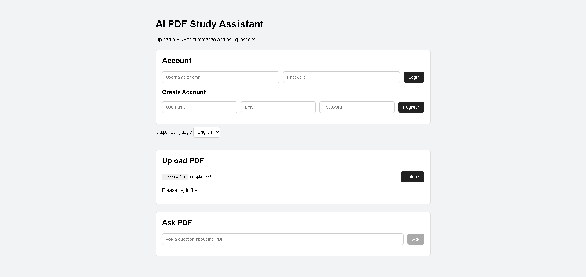
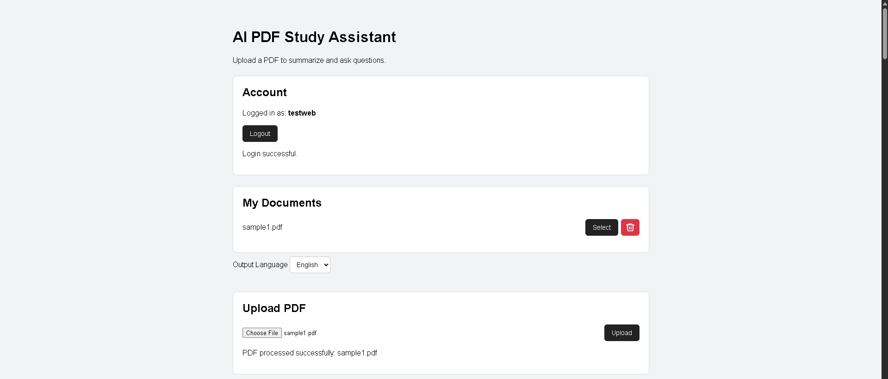
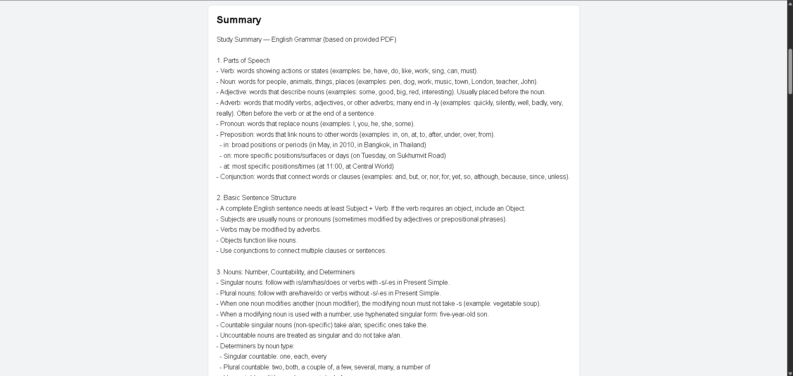
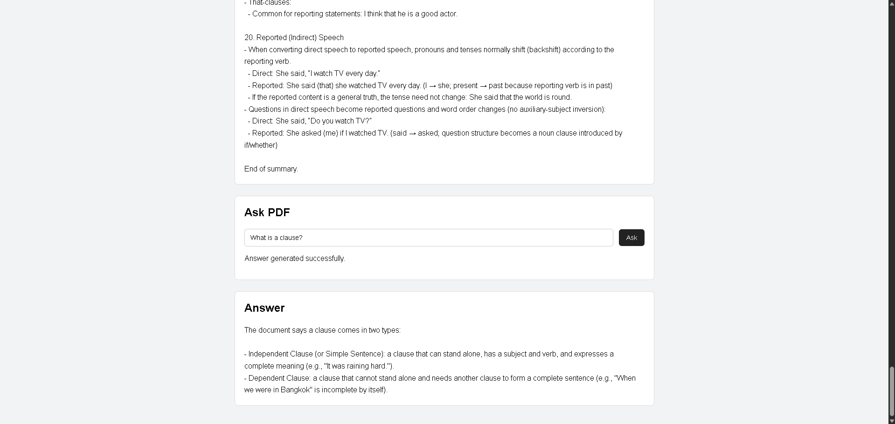

# AI PDF Study Assistant

AI PDF Study Assistant is a web application designed to help users study and understand PDF documents using AI.

Users can upload PDF documents, generate study summaries, and ask questions based on the content of uploaded documents using Retrieval-Augmented Generation (RAG).

This application was developed as an independent Computer Science project.

## Features

- User registration and login
- Secure password hashing
- Upload and process PDF documents
- Extract text from PDF files
- Generate AI-powered study summaries
- Thai and English output support
- Ask questions based on uploaded PDF content
- Retrieval-Augmented Generation (RAG)
- Document history and document selection
- Delete uploaded documents
- Prevent duplicate documents for each user
- Cache embeddings and summaries to reduce repeated processing
- Store user and document information in MySQL
- Remember selected language between page refreshes

## Screenshots

### Authentication

Users must log in before uploading and processing PDF documents.



### Document Management

After logging in, users can upload, select, and delete their PDF documents.



### AI Study Summary

The application generates a structured study summary from the uploaded PDF.



### Document Question Answering

Users can ask questions about the selected PDF. Relevant document content is retrieved using RAG and provided to the LLM to generate an answer.



## How It Works

1. The user registers or logs in.
2. The user uploads a PDF document.
3. PyMuPDF extracts text from the PDF.
4. The extracted text is divided into smaller overlapping chunks.
5. OpenAI embeddings are generated for each chunk.
6. The embeddings are cached for later use.
7. The application generates a study summary from the document.
8. When the user asks a question, the question is converted into an embedding.
9. Cosine similarity is used to find the most relevant document chunks.
10. The relevant chunks are provided to the LLM as context.
11. The LLM generates an answer based on the retrieved PDF content.

## RAG Workflow

```text
PDF
 ↓
Text Extraction
 ↓
Text Chunking
 ↓
OpenAI Embeddings
 ↓
Embedding Cache
 ↓
User Question
 ↓
Question Embedding
 ↓
Cosine Similarity
 ↓
Top Relevant Chunks
 ↓
LLM
 ↓
Answer
```

## Tech Stack

### Backend

- Python
- FastAPI
- Uvicorn

### Frontend

- HTML
- CSS
- JavaScript
- Jinja2

### Database

- MySQL
- MySQL Connector/Python

### AI & Document Processing

- OpenAI API
- GPT-5 mini
- OpenAI `text-embedding-3-small`
- Retrieval-Augmented Generation (RAG)
- Cosine Similarity
- PyMuPDF

### Authentication & Security

- Session-based authentication
- Passlib
- bcrypt
- Environment variables with python-dotenv

### Development Tools

- Git
- GitHub
- VS Code

## Project Structure

```text
AI-PDF/
├── screenshots/
│   ├── login-upload.png
│   ├── after-login-uploaded.png
│   ├── summary.png
│   └── ask-answer.png
├── static/
│   ├── css/
│   └── js/
├── templates/
├── .env.example
├── .gitignore
├── auth.py
├── database.py
├── rag.py
├── schema.sql
├── web.py
├── requirements.txt
└── README.md
```

## Installation

### 1. Clone the repository

```bash
git clone https://github.com/DADEWS/AI-PDF.git
cd AI-PDF
```

### 2. Create a virtual environment

```bash
python -m venv .venv
```

Activate the virtual environment on Windows:

```bash
.venv\Scripts\activate
```

### 3. Install dependencies

```bash
pip install -r requirements.txt
```

### 4. Configure environment variables

Create a `.env` file based on `.env.example`.

```env
OPENAI_API_KEY=your_api_key_here

DB_HOST=localhost
DB_PORT=3306
DB_USER=your_database_user
DB_PASSWORD=your_database_password
DB_NAME=your_database_name

SESSION_SECRET_KEY=your_secret_key_here
```

### 5. Set up MySQL

Create the required MySQL database and run `schema.sql` to create the database tables.

The application uses MySQL to store user accounts and document information.

### 6. Run the application

```bash
uvicorn web:app --reload
```

Open the local address displayed in the terminal.

## Security

Sensitive configuration such as the OpenAI API key, database credentials, and session secret are loaded from environment variables.

The `.env` file is excluded from Git, while `.env.example` is provided as a configuration template.

User passwords are hashed before being stored in the database.

## Project Purpose

This project was developed to apply knowledge in web development, database systems, PDF processing, and Generative AI.

The project demonstrates a Retrieval-Augmented Generation pipeline implemented directly in Python, including PDF text extraction, text chunking, embeddings, cosine-similarity retrieval, and LLM-based question answering.

## Author

Computer Science Student  
Roi Et Rajabhat University
